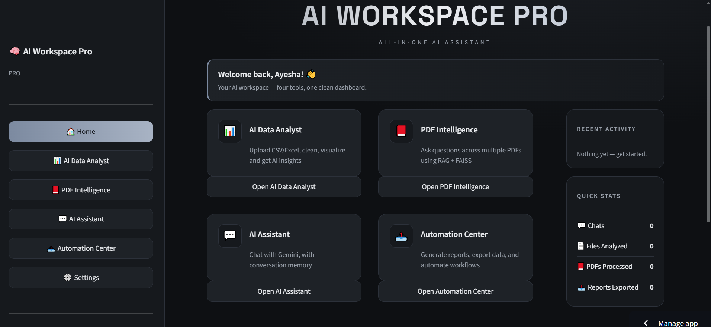
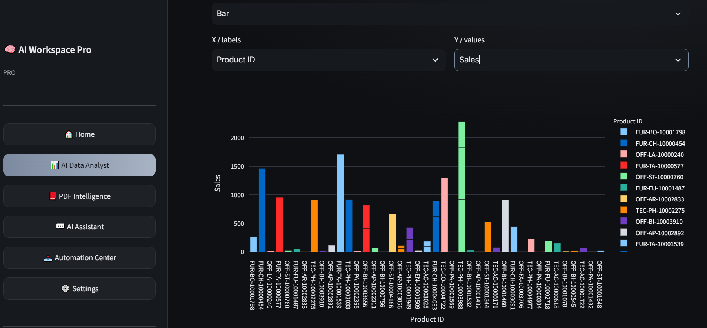
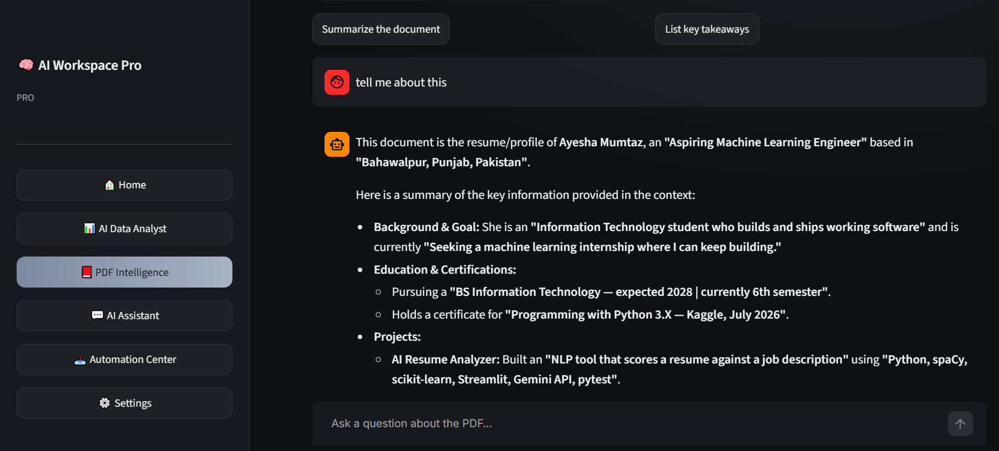
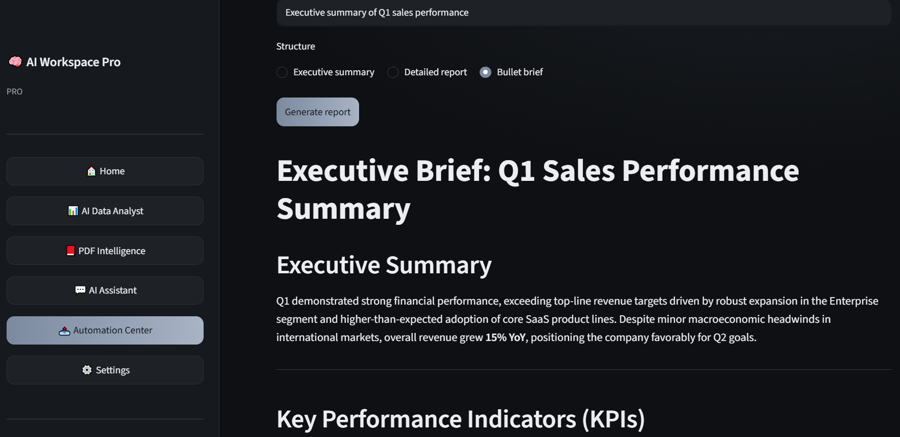

<div align="center">

# 🧠 AI Workspace Pro

### A focused AI workspace — data analysis, PDF intelligence, chat, and automation in one dashboard

[](https://python.org)
[](https://streamlit.io)
[](https://ai.google.dev)
[](https://plotly.com)
[](https://faiss.ai)
[](https://sqlite.org)
[](https://docker.com)
[](LICENSE)

**Built by Ayesha Mumtaz**

AI Workspace Pro is a focused AI workspace built around four production tools — an **AI Data
Analyst**, **RAG-based PDF Intelligence**, a memory-backed **AI Assistant**, and an
**Automation Center** — running locally, containerised with Docker, with history stored in a
SQLite database you own.

[Overview](#overview) · [Demo](#demo) · [Screenshots](#screenshots) · [Features](#features) · [Architecture](#architecture) · [Tech Stack](#tech-stack) · [Retrieval Engine](#retrieval-engine) · [Getting Started](#getting-started) · [Deployment](#deployment) · [Troubleshooting](#troubleshooting)

</div>

---

## Quick Start

```bash
git clone https://github.com/ayeshamumtaz1057/ai-workspace-pro.git
cd ai-workspace-pro
cp .env.example .env          # paste your Gemini API key
pip install -r requirements.txt
streamlit run app.py
```

Open the app at **http://localhost:8501**, or run it in a container:

```bash
docker compose up --build
```

For full setup, environment variables and troubleshooting, see [DEPLOY.md](DEPLOY.md).

---

## Overview

AI Workspace Pro turns scattered AI-assisted work into one clean workflow. Upload a
spreadsheet and get charts plus written analysis. Drop in a stack of PDFs and ask questions
answered from the documents themselves. Chat with a memory-backed assistant. Then package any
output into a downloadable report — all from a single dashboard.

### The Problem

Getting real work out of AI today means juggling several disconnected services. One tab for
chat, another for a PDF summariser, a third for charting a spreadsheet, a fourth for building
a report. Each has its own login, its own quota, its own conventions. Your history is
scattered across several companies' servers, and none of the tools know about each other.

### The Solution

AI Workspace Pro unifies the core of that work behind one dashboard, so every task follows the
same four steps:

1. **Select** — pick a tool from the sidebar or the home grid
2. **Upload** — drop in a file or paste text
3. **Process** — rules run locally, and the AI layer runs on top where it adds value
4. **Export** — download results as Word, Markdown, CSV or Excel

Everything runs on your machine. History lives in a local SQLite file. Nothing is uploaded
anywhere except the specific text you submit to the model.

---

## Demo

> Add your demo video link here.

**Full walkthrough:** [Watch on LinkedIn](https://www.linkedin.com/in/ayesha-mumtaz-82b8913a9/)

**Live app:** [ai-workspace-pro.streamlit.app](https://ai-workspace-pro-omhnybsccue8476d7fruqd.streamlit.app/)

---

## Screenshots

### Dashboard

Feature cards, a live activity feed, and usage counters that update as you work. The gradient wordmark, graphite cards and hover states are hand-written CSS injected over
Streamlit's defaults.



### AI Data Analyst — the main feature

Upload a CSV or Excel file and move through five tabs — preview, clean, visualize, AI
insights, export. Cleaning decisions carry through to the charts automatically.



### PDF Intelligence (RAG)

Ask questions across multiple PDFs. Answers are drawn from retrieved passages via FAISS, not
from the model's memory, so they stay grounded in your documents.



### Automation Center

Turn any AI output into a downloadable Word or Markdown report, batch-summarize several PDFs
at once, and export your full activity history to CSV or Excel.



---

## Features

### 1. AI Data Analyst — *main feature*

| Capability | Detail |
|---|---|
| Upload | CSV, XLSX and XLS files, with a built-in sample dataset |
| Profiling | Row/column counts, missing values, duplicates, full statistics |
| Cleaning | Drop duplicates, fill nulls (zero / mean / median), or drop rows |
| Visualization | Six Plotly chart types — bar, line, pie, scatter, histogram, box |
| AI Insights | Sends a data profile to Gemini and returns a written analysis |
| Export | Download the cleaned result as CSV or Excel |

### 2. PDF Intelligence (RAG)

| Capability | Detail |
|---|---|
| Multiple PDFs | Index several documents at once |
| Question answering | Ask anything; answers cite the source passages |
| FAISS retrieval | Chunking + TF-IDF vectors + FAISS similarity search |
| Context-based answers | The model is instructed to answer only from retrieved context |

### 3. AI Assistant

| Capability | Detail |
|---|---|
| Gemini API | Powered by Google's Gemini models |
| Chat memory | Multi-turn conversation with history persisted to SQLite |
| Preset prompts | One-click starters for common questions |

### 4. Automation Center

| Capability | Detail |
|---|---|
| Report generation | Turn any prompt into a polished Word or Markdown document |
| Batch processing | Summarize a folder of PDFs in one pass |
| Export | Activity history and stats to CSV or Excel |

### Cross-cutting

| | |
|---|---|
| 🎨 **Custom theme** | Refined graphite/grey palette, gradient wordmark, hover-lift cards — hand-written CSS |
| 📈 **Live dashboard** | Recent-activity feed and usage counters that update as you work |
| 💾 **Persistence** | SQLite stores history, stats and settings across restarts |
| 🔑 **Bring your own key** | Users paste their own API key in Settings, kept in session only |
| 📤 **Export everywhere** | Markdown, Word, CSV and Excel output |
| 🛡️ **Graceful fallback** | Rule-based paths keep working with no API key or exhausted quota |

---

## Architecture

```
        User (Browser)
      Streamlit UI + custom CSS
                │
                │  ROUTES[page].render()
                ▼
  ┌──────────────────────────────┐
  │           app.py             │
  │  sidebar · dashboard · router│
  └──────────────┬───────────────┘
                 │
      ┌──────────┼──────────┐
      ▼          ▼          ▼
┌─────────┐ ┌────────┐ ┌──────────┐
│ data.py │ │pdfchat │ │ chat.py  │  + automate.py
└────┬────┘ └───┬────┘ └────┬─────┘
     │          │           │
     └──────────┼───────────┘
                ▼
  ┌──────────────────────────────┐
  │            core/             │
  │  ai.py    ──── Gemini API    │
  │  db.py    ──── SQLite        │
  │  theme.py ──── CSS injection │
  └──────────────┬───────────────┘
                 ▼
  ┌──────────────────────────────┐
  │  config.py                   │
  │  design tokens · feature     │
  │  registry · constants        │
  └──────────────────────────────┘
```

**Flow:** `app.py` reads the feature registry from `config.py` to build the sidebar and home
grid, then dispatches to a module's `render()` function. Each module is fully independent — it
imports only from `core/`, never from another module. All model calls funnel through
`core/ai.py`, so retry logic, error handling and the missing-key fallback live in exactly one
place. All persistence funnels through `core/db.py`, so no module writes raw SQL.

**Why it's structured this way:** adding a new tool touches three lines — one new module file,
one row in `FEATURES`, one entry in `ROUTES`. Nothing existing changes.

---

## Tech Stack

| Layer | Technology |
|---|---|
| Frontend | Streamlit 1.40, custom CSS injection |
| UI Style | Dark graphite/grey with subtle gradients, gradient wordmark and hover-lift cards |
| AI | Google Gemini API (`gemini-3.6-flash`) |
| Data | Pandas 2.2, NumPy |
| Charts | Plotly (bar, line, pie, scatter, histogram, box) |
| Retrieval | scikit-learn TF-IDF vectors + FAISS `IndexFlatIP` |
| Documents | pypdf, python-docx, openpyxl |
| Database | SQLite 3 |
| Deployment | Docker Compose, Streamlit Community Cloud |

### Why these choices

| Decision | Reasoning |
|---|---|
| Streamlit over React | File uploads, interactive charts and chat widgets would take much longer to wire up in React. Streamlit delivered it in days. The re-run-on-interaction trade-off is handled with `st.session_state` and `@st.cache_resource`. |
| Gemini Flash over Pro | 1–2 second responses versus 5+. When a user is waiting on a button press, latency matters more than marginal quality. |
| TF-IDF over embeddings | Real embeddings mean one API call per chunk — slow and costly. TF-IDF is instant, local, free, and accurate enough for keyword-driven document Q&A. |
| SQLite over Postgres | Zero configuration, single file, no server. Correct up to tens of concurrent users, and `core/db.py` is a clean boundary to swap later. |
| Plotly over Matplotlib | Interactive by default — hover, zoom, pan — and themes cleanly against a dark background. |
| Docker for deployment | One command brings up the app with a mounted volume, so the SQLite database survives restarts. |

---

## Retrieval Engine

PDF Intelligence is the technical core of the project. Rather than dumping an entire document
into the prompt — which breaks past a few pages and burns tokens — it implements a retrieval
pipeline.

### Pipeline

```
PDF upload
    │
    ▼
Text extraction (pypdf)
    │
    ▼
Chunking — 900 words, 150-word overlap
    │
    ▼
Vectorization — TF-IDF, 8192 features, L2 normalized
    │
    ▼
Index — FAISS IndexFlatIP  (NumPy dot product if FAISS unavailable)
    │
    ▼
Query → top-5 passages → grounded prompt → answer
```

### The chunking logic

```python
def chunk(text, size=900, overlap=150):
    words, out, i = text.split(), [], 0
    step = max(1, size - overlap)
    while i < len(words):
        out.append(" ".join(words[i:i + size]))
        i += step
    return [c for c in out if c.strip()]
```

The overlap is the entire point. Without it, a sentence straddling a chunk boundary gets split
in half and neither fragment retrieves properly. A 150-word overlap guarantees every passage
appears intact in at least one chunk.

### Grounding

Retrieved passages are passed with an explicit instruction to answer from the supplied context
alone and to say so plainly when the answer isn't present. This is what separates a citation
from a hallucination.

### Characteristics

| Property | Value |
|---|---|
| Chunk size | 900 words with 150-word overlap |
| Vector dimensions | Up to 8192 TF-IDF features |
| Similarity metric | Cosine (inner product on L2-normalized vectors) |
| Passages retrieved | Top 5 per query |
| Index time | ~2 seconds for a 200-page document |
| Query time | Under 100 ms |
| Fallback | NumPy dot product — FAISS is an optimization, not a requirement |

---

## Data Pipeline

The AI Data Analyst is the main feature, and it does more than draw a chart. It runs a small
pipeline end to end.

```
Upload (CSV / XLSX)
    │
    ▼
Load with Pandas  →  auto-detect types
    │
    ▼
Profile  →  rows, columns, missing values, duplicates, describe()
    │
    ▼
Clean  →  drop duplicates · fill nulls (zero / mean / median) · drop rows
    │
    ▼
Visualize  →  6 Plotly chart types, cleaned data flows through automatically
    │
    ▼
AI Insights  →  a compact profile (not raw rows) is sent to Gemini
    │
    ▼
Export  →  cleaned CSV / Excel
```

### Why send a profile, not the rows

Uploading a large spreadsheet's raw rows into the prompt is slow, expensive, and often exceeds
the context window. Instead the app builds a compact profile — shape, column types, summary
statistics and a small sample — and sends that. The model gets everything it needs to reason
about the dataset while the token cost stays flat regardless of file size.

### Cleaning flows into charting

The cleaned dataframe is held in session state, so a decision made on the Clean tab (say,
filling missing values with the median) is the data the Visualize and Export tabs use. There's
no re-uploading and no stale copies.

---

## Project Structure

```
ai-workspace-pro/
├── app.py                       Shell: sidebar nav, dashboard, router
├── config.py                    Design tokens, feature registry, constants
│
├── core/
│   ├── ai.py                    Gemini wrapper, key resolution, offline fallback
│   ├── db.py                    SQLite layer: chats, stats, settings
│   └── theme.py                 CSS injection, card component, header
│
├── modules/                     One file per tool, each exposing render()
│   ├── data.py                  AI Data Analyst: preview, clean, chart, insights, export
│   ├── pdfchat.py               PDF Intelligence: chunking + TF-IDF + FAISS retrieval
│   ├── chat.py                  AI Assistant with session memory
│   ├── automate.py              Automation Center: report generation, batch PDF, export
│   └── settings.py              Appearance, API key, stats, data controls
│
├── .streamlit/
│   └── config.toml              Streamlit theme configuration
│
├── assets/                      Screenshots
├── data/                        SQLite database (gitignored, auto-created)
│
├── requirements.txt             Python dependencies
├── packages.txt                 System packages for cloud deployment
├── Dockerfile                   Container build
├── docker-compose.yml           One-command deployment with volume
├── .env.example                 Environment configuration template
├── DEPLOY.md                    Extended deployment guide
└── LICENSE
```

---

## Getting Started

### Prerequisites

| Requirement | Version | Required? |
|---|---|---|
| Python | 3.9+ | Yes |
| Gemini API key | — | For AI features ([free from AI Studio](https://aistudio.google.com/app/apikey)) |
| Docker | 20+ | Only for containerized deployment |

### Quick start with Docker

```bash
git clone https://github.com/ayeshamumtaz1057/ai-workspace-pro.git
cd ai-workspace-pro
cp .env.example .env
docker compose up --build
```

Open the app at http://localhost:8501

### Manual setup

**1.** Clone and enter the project

```bash
git clone https://github.com/ayeshamumtaz1057/ai-workspace-pro.git
cd ai-workspace-pro
```

**2.** Create and activate a virtual environment

```bash
python -m venv .venv

.venv\Scripts\activate          # Windows
source .venv/bin/activate       # macOS / Linux
```

**3.** Install dependencies

```bash
pip install -r requirements.txt
```

**4.** Configure your key

```bash
cp .env.example .env            # Windows: copy .env.example .env
```

**5.** Run

```bash
streamlit run app.py
```

---

## Environment Configuration

```env
GEMINI_API_KEY=your_key_here
GEMINI_MODEL=gemini-3.6-flash
```

| Variable | Default | Description |
|---|---|---|
| `GEMINI_API_KEY` | — | Your Google AI Studio key |
| `GEMINI_MODEL` | `gemini-3.6-flash` | The Gemini model used for all AI features |

The app resolves the key in this order: **session input → hosting secrets → `.env` file**, so
the same code runs locally and deployed without modification.

> ⚠️ Never commit your `.env` file. Use `.env.example` as the template — `.gitignore` already
> excludes the real one.

---

## Deployment

### Streamlit Community Cloud (free)

1. Push this repository to GitHub as **public**
2. Go to [share.streamlit.io](https://share.streamlit.io) → **Create app**
3. Repository `ayeshamumtaz1057/ai-workspace-pro`, branch `main`, main file `app.py`
4. Under **Advanced settings → Secrets**, paste:

```toml
GEMINI_API_KEY = "your_key_here"
GEMINI_MODEL = "gemini-3.6-flash"
```

5. Deploy.

> The free tier is 1 GB RAM. If the build is killed, remove `faiss-cpu` from
> `requirements.txt` — retrieval falls back to scikit-learn with no code change.

### Docker (persistent data)

```bash
export GEMINI_API_KEY=your_key_here
docker compose up -d --build
```

Serves on port 8501 with `./data` mounted so the database survives rebuilds.

Instructions for Hugging Face Spaces, Render, Railway and Fly.io are in [DEPLOY.md](DEPLOY.md).

---

## Troubleshooting

### Setup

| Error | Fix |
|---|---|
| `'python' is not recognized` | Reinstall Python and tick **Add Python to PATH**, or use `py` on Windows |
| `ModuleNotFoundError: No module named 'streamlit'` | Virtual environment isn't active — activate it, then reinstall requirements |
| `Microsoft Visual C++ 14.0 is required` | Run `python -m pip install --upgrade pip` so pip finds a prebuilt wheel |
| `faiss-cpu` won't install | Delete the line from `requirements.txt` — it's optional |

### Runtime

| Error | Fix |
|---|---|
| `No API key configured` | Check Settings, hosting secrets, then `.env`. Common trap: file is still named `.env.example` |
| `400 API key not valid` | Key copied with trailing space or quotes. Regenerate and repaste |
| `429 Resource has been exhausted` | Free quota hit. Wait a minute and retry |
| `404 model ... is no longer available` | Model retired. Set `GEMINI_MODEL` to `gemini-3.6-flash` in Settings or Secrets |
| PDF Intelligence: *No selectable text found* | The PDF is a scan (images, not text). Use a text-based PDF |
| `could not convert string to float` | A text column was picked for a numeric chart axis. Use Bar or Pie instead |

### Git & GitHub

| Error | Fix |
|---|---|
| `fatal: pathspec 'add' did not match any files` | Command typed twice. It's just `git add .` |
| `! [rejected] main -> main (fetch first)` | Remote has commits you don't. `git pull origin main --rebase` then `git push` |
| `fatal: repository '.../tree/main/' not found` | URL copied from the browser bar. `git remote set-url origin https://github.com/USER/REPO.git` |
| `Support for password authentication was removed` | Use a Personal Access Token: Settings → Developer settings → Tokens (classic) → scope `repo` |

### Deployment

| Error | Fix |
|---|---|
| `Main file does not exist` | `app.py` is nested one folder deep. Re-upload the folder's contents |
| Build `Killed` during install | Out of memory on the free tier. Remove `faiss-cpu` and redeploy |
| Every AI feature returns the no-key message | Secrets not saved. TOML needs quotes: `GEMINI_API_KEY = "AIza..."` |
| Stats reset daily | Expected — cloud filesystems are ephemeral. Use Docker with a volume |

---

## FAQ

<details>
<summary><b>Do I need to pay for anything?</b></summary>

No. Gemini's free tier covers normal use, Streamlit Cloud hosting is free, and every library
is open source.
</details>

<details>
<summary><b>Is my data sent anywhere?</b></summary>

Only what you explicitly submit to the model goes to Google's API. Files are processed in
memory; the Data Analyst sends a compact profile rather than raw rows. History stays in a local
SQLite file.
</details>

<details>
<summary><b>Can I use OpenAI or Claude instead of Gemini?</b></summary>

Yes — rewrite the `ask()` function in `core/ai.py`. It's the only file that talks to a model.
Nothing else changes.
</details>

<details>
<summary><b>What happens without an API key?</b></summary>

The app still loads and every screen renders. Rule-based paths — data profiling, cleaning,
charts, exports — work fully offline. Model-backed answers return a clear "no key configured"
notice instead of failing.
</details>

<details>
<summary><b>How many people can use it at once?</b></summary>

Streamlit Cloud's free tier handles a handful comfortably. SQLite is fine to roughly 50
concurrent users; past that, swap `core/db.py` for Postgres.
</details>

<details>
<summary><b>Why is it deployed with Docker as well as Streamlit Cloud?</b></summary>

Streamlit Cloud is the easiest public demo, but its filesystem is ephemeral — stats reset on
restart. Docker with a mounted volume keeps the SQLite database, which is the right setup for
persistent use.
</details>

---

## What I Learned

**Streamlit's execution model.** The entire script re-runs on every interaction. Knowing when
to use `st.session_state` versus `@st.cache_resource` was the difference between an app that
felt sluggish and one that felt instant.

**Retrieval beats a bigger context window.** Dumping a whole document into a prompt breaks past
a few pages and costs a fortune. Chunking with overlap plus similarity search handles a
200-page PDF while sending a fraction of the tokens.

**Design your failure modes.** The most valuable thing I built was the fallback in
`core/ai.py`. Demos happen when quota is exhausted and keys expire. An app that shows a clear
message beats one that shows a stack trace.

**Registries prevent drift.** Feature names originally lived in three places and kept falling
out of sync. Moving them into one list in `config.py` eliminated a whole class of bug.

**A clean module boundary pays off.** Because every tool imports only from `core/`, removing or
adding a feature is a local change — the day I trimmed the project down to its core tools, it
took minutes and broke nothing.

---

## Roadmap

- [ ] User accounts with per-user history
- [ ] PostgreSQL backend for multi-user deployments
- [ ] Streaming responses in the AI Assistant
- [ ] Sentence-transformer embeddings as a TF-IDF upgrade
- [ ] Unit tests and CI pipeline

---

## Contributing

Contributions are welcome.

```bash
git checkout -b feature/your-feature
git commit -m "Add your feature"
git push origin feature/your-feature
```

Please keep the one-`render()`-per-module contract and route all model calls through
`core/ai.py`.

### Adding a new tool

```python
# modules/yourtool.py
import streamlit as st
from core import ai

def render():
    st.subheader("🔧 Your Tool")
    prompt = st.text_area("Input")
    if st.button("Run", type="primary"):
        st.markdown(ai.ask(prompt, system="You are a helpful assistant."))
```

Then add `("yourtool", "Your Tool", "🔧", "Short description")` to `FEATURES` in `config.py`
and `"yourtool": yourtool` to `ROUTES` in `app.py`. It appears in the sidebar and home grid
automatically.

---

## License

Distributed under the MIT License. See [LICENSE](LICENSE) for details.

---

## Acknowledgements

- [Streamlit](https://streamlit.io) — the framework the workspace is built on
- [Google AI Studio](https://ai.google.dev) — free Gemini API access
- [FAISS](https://faiss.ai) — Meta's similarity search library

---

## Author

**Ayesha Mumtaz**

[](https://github.com/ayeshamumtaz1057)

---

<div align="center">

**⭐ Star this repo if you found it useful**

</div>
